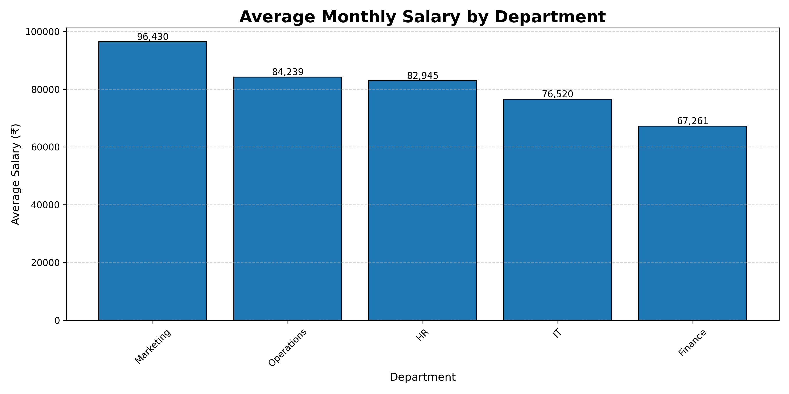
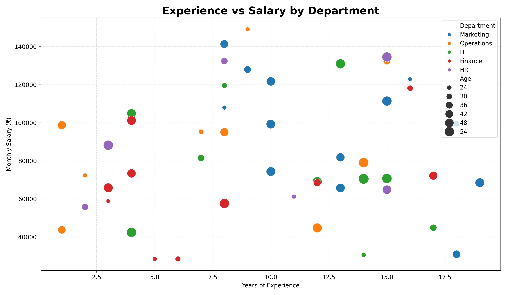
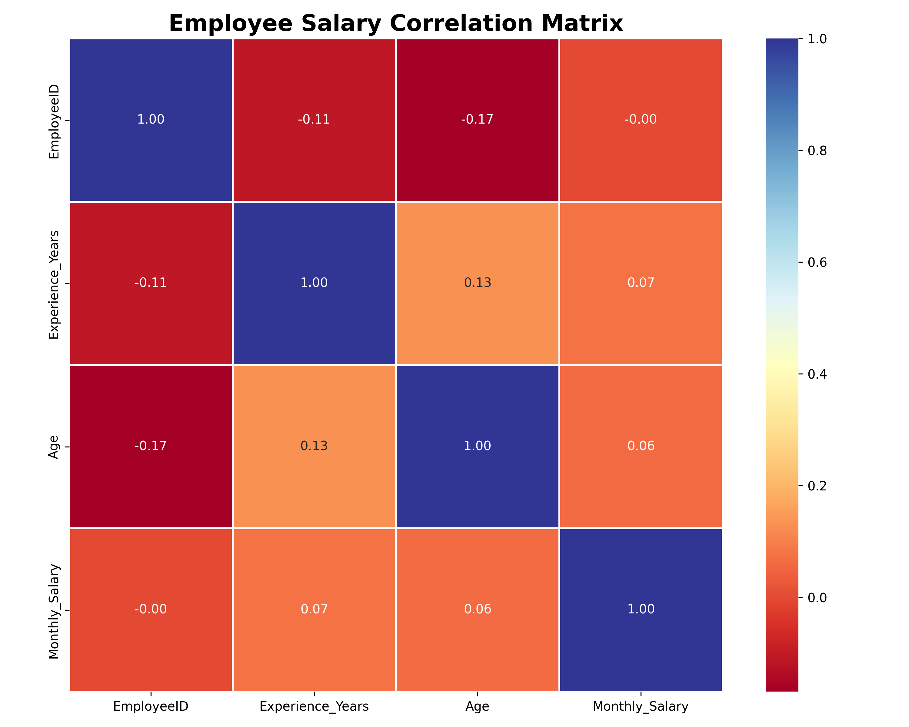
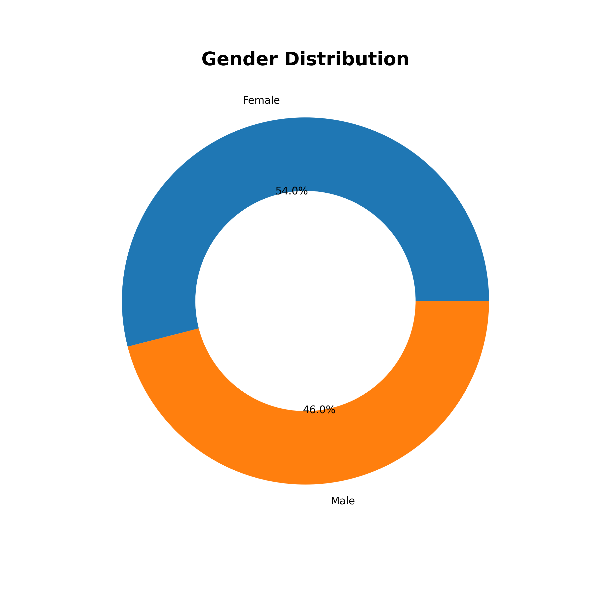
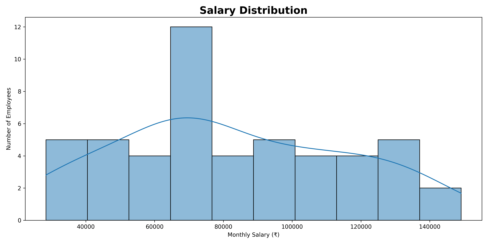

# Employee Salary Data Analysis

## Project Overview

This project analyzes employee salary data using Python. The dataset is explored and visualized using Pandas, Matplotlib, and Seaborn to identify salary patterns, departmental trends, employee demographics, and relationships between experience and salary.

---

## Objective

The objective of this project is to:

* Load and analyze employee salary data from a CSV file.
* Perform statistical analysis using Pandas.
* Visualize salary trends using charts and graphs.
* Identify relationships between employee attributes and salary.
* Present findings through meaningful visualizations.

---

## Technologies Used

* Python
* Pandas
* NumPy
* Matplotlib
* Seaborn

---

## Dataset Information

The dataset contains the following fields:

* EmployeeID
* Name
* Department
* Experience_Years
* Education_Level
* Age
* Gender
* City
* Monthly_Salary

---

## Analysis Performed

### Data Exploration

* Dataset inspection
* Missing value analysis
* Statistical summary

### Salary Analysis

* Average salary
* Maximum salary
* Minimum salary
* Median salary

### Department Analysis

* Average salary by department

### Gender Analysis

* Employee gender distribution

### Correlation Analysis

* Relationship between salary, age, and experience

---

## Visualizations

### 1. Average Salary by Department

Shows the average monthly salary across different departments.



---

### 2. Experience vs Salary

Shows the relationship between employee experience and monthly salary.



---

### 3. Correlation Heatmap

Displays correlations between numerical variables.



---

### 4. Gender Distribution

Displays the gender distribution of employees.



---

### 5. Salary Distribution

Shows how employee salaries are distributed across the organization.



---

## Key Insights

* Salary generally increases with years of experience.
* Different departments have different average salary levels.
* Experience has a positive relationship with salary.
* Employee demographics contribute to salary variation.
* Correlation analysis helps identify important relationships among variables.

---

## Conclusion

This project demonstrates how Python can be used for data analysis and visualization. Using Pandas, Matplotlib, and Seaborn, meaningful insights were extracted from employee salary data through statistical analysis and visual representations.

---

## Project Structure

```text
Employee-Salary-Analysis/
│
├── data/
│   └── employee_salary_dataset.csv
│
├── images/
│   ├── bar_chart.png
│   ├── scatter_plot.png
│   ├── heatmap.png
│   ├── gender_distribution.png
│   └── salary_distribution.png
│
├── main.py
├── README.md
└── requirements.txt
```

## How to Run

```bash
pip install -r requirements.txt
python main.py
```
